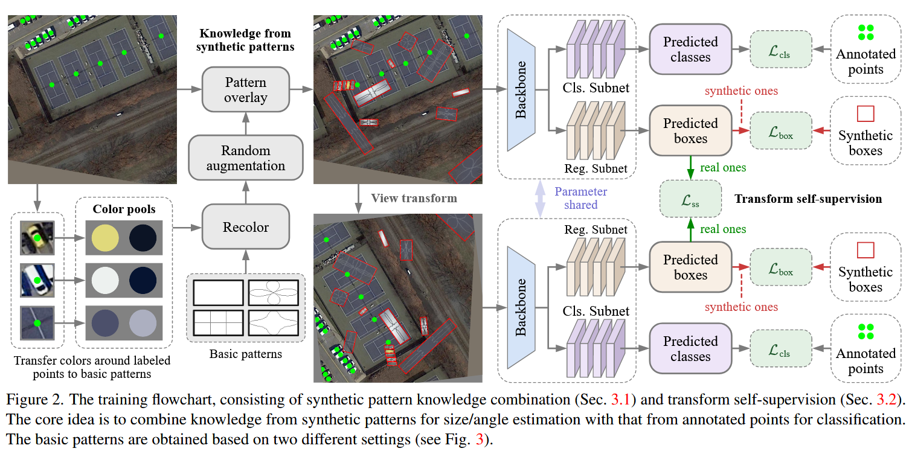
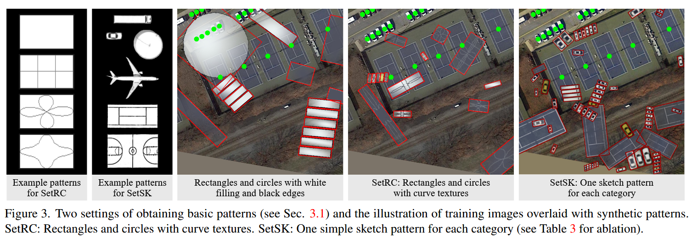

# 《Point2RBox: Combine Knowledge from Synthetic Visual Patterns for End-to-end Oriented Object Detection with Single Point Supervision》 阅读笔记

## 简介

利用知识组合和自监督的方式，让网络能够通过点标注，学习到点标注中没有的尺度，预测旋转框。是第一个端到端的点监督方案。

## 背景

H2RBox 和它的 v2 出现了，Point2RBox 还会远吗？
其实已经存在一些点监督的检测器了：P2BNet[^1]、Point2Mask[^2]、SAM[^3]……但是它们成本高效率低精度差，而且没有端到端的直接从点到旋转框的方法。

[^1]: P2BNet 在标记点附近设置几个不同宽高比和尺度的 Box，然后通过 MIL 分类选择最佳拟合的候选框，再迭代优化，达到 Point→HBox 的效果。
[^2]: Point2Mask 将伪掩码生成建模为最优传输问题，仅需单个随机点标注即可实现高质量泛视觉分割。模型视标签点为供应商，像素为消费者，并利用类别语义图和实例边界图定义传输成本。通过 Sinkhorn-Knopp 迭代求解最优传输计划，生成精准伪掩码，优化泛视觉分割子网络。
[^3]: SAM 同样是通过 Point 或者 HBox 生成掩码。

既然人类具有从草图里面学习到物体特征，并且能够通过学习到的内容和一些引导（比如用手指）辨认出目标，那么模型也可以有这个能力。

## 实现

模型由两个部分组成：合成图案知识组合和变换自监督。

### 合成图案知识组合

没有可以学习的东西，我们就自己创造用来学习的东西。通过一些方法生成学习的 pattern 并且进行数据增强+NMS，然后随机覆盖在在输入图像上（边缘透明）。这些带有旋转框的 pattern 用来监督回归损失。

#### 两种图案生成方式

1. SetRC
   通过白色矩形和黑色线合成图案。
   线可以是几根平行线，也可以是满足这个极坐标方程的曲线：
   $$
   \rho = (1 - k) \left| \cos^n(2\theta) \right| + k
   $$
2. SetSK
   引入少量人工先验，把 dataset 的每一个类别抠图并且处理成灰度图像（白色表面，黑色边缘）。

#### 上色

$$
\left\{
\begin{array}{l}
C_{\text{face}} = \text{mean} \left( I_0 \right) \\
C_{\text{edge}} = \text{sum} \left( dI_1 \right)
\end{array}
\right.
$$

论文中，$I_0$取$5 × 5$，$I_1$取 $33 × 33$。
按照这个方式处理，通过每个点标注提取它的邻域的颜色，决定合成图案的表面颜色和边缘颜色。
第一条就是取离点很近的位置的颜色均值（代表它最明显的颜色），第二条用像素梯度幅度$d$加权颜色（梯度$d$需要归一化为 1）求和，这样周围剧烈变化的像素（更可能是边缘）就会贡献更大。

然后给图案涂颜色：

$$
P_{\text{recolor}} = PC_{\text{face}} + (1 - P) \, C_{\text{edge}}
$$

之后就是数据增强（随机翻转、放缩大小、旋转）然后随机放置。
另外，在放置的时候，会处理成中间透明边缘不那么透明的，以免遮挡 GT。

### 变换自监督

把 H2RBox 中的旋转和翻转合并，再加进一个缩放，并且设置有 30%的概率缩放，剩下的$P(旋转):P(翻转)=95:5$。
然后让原始视图和变换视图相互自监督。注意变换的时候不能把合成图案放进去一起变，它们已经有可知的边界框了。

旋转和翻转和以前的损失没有任何区别。缩放的损失，是把原始图像缩放之后，把两个图像取外接水平框后计算 GIoU。
这里不用 CircumIoU loss 的原因应该是因为这里需要的是缩放一致性，而不是输出矩形框，所以用低成本的 GIoU 即可。

### 损失函数

下面的损失函数用的$L$都取决于 backbone。

- **点监督的损失**：

  $$
  \left\{
  \begin{array}{l}
  \mathcal{L}_{\text{cls}} = L_{\text{cls}}\left(M_{\text{point}}c_{\text{pred}}, M_{\text{point}}c_{\text{gt}}\right) \\
  \mathcal{L}_{\text{cen}} = L_{1}\left(M_{\text{point}}xy_{\text{pred}}, M_{\text{point}}xy_{\text{gt}}\right)
  \end{array}
  \right.\\
  $$

  单纯是在计算类别和中心点损失。$M$是掩码，筛选出来真实的点标注对应的旋转框。

- **知识组合损失**：

  $$
  \mathcal{L}_{\text{box}} = L_{\text{box}}\left(M_{\text{box}} B_{\text{pred}}, M_{\text{box}} B_{\text{gt}}\right)
  $$

  $M_{box}$是筛选出合成图案对应的框。

- **变换自监督损失**：
  $$\mathcal{L}_{\text{ss}} = L_{\text{flip/rot/sca}}\left(M_{\text{ori}}M_{\text{point}}B_{\text{pred}}, M_{\text{trs}}M_{\text{point}}B_{\text{pred}}\right)$$
  把参与了变换的框过滤出来，计算损失

- **总损失**
  加权相加即可。

### 标签分配

因为点标注没法提供尺寸相关的信息，所以 backbone 不能用 FPN-based 的 detector 作为 backbone。难得 YOLOF 是只使用一个级别的尺度特征，它使用尺寸 32, 64, 128, 256 和 512 的锚框，它自己的锚框分配逻辑还是不能用。所以只能自己制定分配策略。
用 YOLOF 作为 backbone，但是把它的所有五种 anchor size 调到同一个值（DOTA 是 64，别的是 128），但是 anchor size 不减少。（减少的话会掉点）

分配策略：中心点太远的就不要，近的话按照分类损失（种类能匹配上的可能性越高越好）匹配。对于每一个 GT，用 K 邻近找到四个最高分的锚框匹配。

$$
score =
\begin{cases}
0, & L_1 \left( xy_{\text{pred}}, xy_{\text{gt}} \right) > 32 \\
L_{\text{cls}} \left( c_{\text{pred}}, c_{\text{gt}} \right), & \text{otherwise}
\end{cases}
$$
