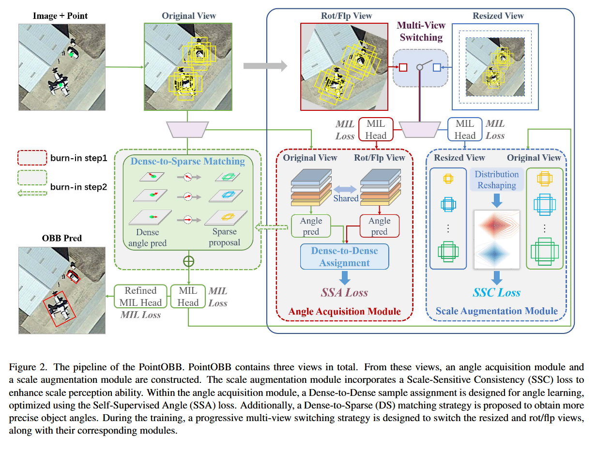

# 《PointOBB: Learning Oriented Object Detection via Single Point Supervision》略读

## 结构

## 贡献

同样是点监督下实现的目标检测。PointOBB 主要侧重**精度**，但是效率有所牺牲；Point2RBox 效率高，然而需要先验且精度不高。
PointOBB 通过多视图数据增强和内部一致性约束来学习尺度和角度；Point2RBox 则通过引入合成图案的外部几何知识和变换自监督，实现对定向框的直接回归。

## 原理

作为模块化的 PointOBB 是和 detector 解耦的。它直接脱离 detector 在弱监督下预测旋转框，再作为伪标签训练。
主要使用 MIL 架构网络。实际上 PointOBB 就是沿着 MIL 做的，顺手解决了 MIL 不稳定的问题。（MIL 存在仅关注局部最显著区域的风险）

> MIL：把一堆实例打包到一起的方法。。MIL 把一个标注点周围生成的所有候选框打包起来，对每个候选包做整体预测，在候选区域中选择得分最高的候选框作为最终的检测结果，同时输出该候选框的类别和位置（或后续进一步回归得到的边界框信息）。整个过程通过 MIL loss 进行训练，确保所选的候选框不仅具有高分类得分，也尽量准确地覆盖整个目标。输出有两个得分：
>
> > 实例得分（Instance Score）：反映了该候选框作为一个“对象实例”的可信度，也就是它有多大可能覆盖到目标的实际区域，衡量目标的存在性或显著性。
> > 类别得分（Class Score）：表示候选框属于各个类别的概率分布，反映了分类器对候选框具体类别的信心。

### 渐进匹配策略

第一步，先 resize，利用缩放一致性得到尺度和边界信息；
第二步，进旋转翻转模块，得到方向性；
第三步，利用 DS 匹配策略，对齐密集的角度预测和稀疏的 Proposal。（其实是和第二步一起的）

### 尺度增强模块

利用中心点生成多个 Proposal，每个中心点的 Proposal 打包，扔进缩放模块里面后通过 MIL head。
为比较两个视图，先将候选框分数按照一系列基本尺度分组，然后重塑分数矩阵（按照尺度分组）。
原始视图再和缩放视图计算相似度。由上，网络会让同一目标在不同尺度下候选框分数一致，这样尺度估计就准确了。
$$sim_{m,g}^{ins} = 1 - \frac{[S_{io}^{ins}]_{m,g} \cdot [S_{id}^{ins}]_{m,g}}{\|[S_{io}^{ins}]_{m,g}\| \cdot \|[S_{id}^{ins}]_{m,g}\|},$$
$$sim_{m,g}^{cls} = 1 - \frac{[S_{io}^{cls}]_{m,g} \cdot [S_{id}^{cls}]_{m,g}}{\|[S_{io}^{cls}]_{m,g}\| \cdot \|[S_{id}^{cls}]_{m,g}\|},$$
$$\mathcal{L}_{SSC} = \sum_{m=1}^{M} \sum_{g=1}^{G} \left\{ \omega_1 \ell_s(sim_{m,g}^{ins}, 0) + \omega_2 \ell_s(sim_{m,g}^{cls}, 0) \right\},$$

### 角度获取模块

相比起尺度增强模块，角度获取模块多了一个 DS 匹配。
网络在特征金字塔上的各个层级都会根据每个点标签的邻域生成正样本，因此会生成密集的角度预测。对同一级别，我们先取它们的平均角度作为初步结果。
Proposal 是比较稀疏的，所以直接匹配容易导致尺度和感受野不匹配。因此根据候选框尺寸把候选框划分到不同尺寸层次。在对应层级上，只利用中心区域内的密集角度预测，通过它们的平均预测值来作为结果。

$$
\left\{
\begin{array}{l}
\mathcal{L}_{\text{rot}} = \min_{k \in \mathbb{Z}} \sum_{p=1}^{P} \ell_{\text{angle}}(\theta_{\text{rot}}^p - \theta^p, k\pi + \theta^\prime) \\
\mathcal{L}_{\text{flip}} = \min_{k \in \mathbb{Z}} \sum_{p=1}^{P} \ell_{\text{angle}}(\theta_{\text{flip}}^p + \theta^p, k\pi)
\end{array}
\right.
$$
两条加起来就是这个模块的损失。

### MIL 损失

MIL 本身应该也要有损失来改进自己，来监督它对候选包中的最优 Proposal 的选择。每个视图中的 MIL 都要计入。此外，不同的 stage 中还要调整它们是否计入损失（因为有三步走）。

$$
\mathcal{L}_{MIL_{\text{init}}} = -\frac{1}{I} \sum_{i=1}^{I} \sum_{c=1}^{C} \left\{ Q_{i,c} \log(S_{i,c}) \right. \\
\left. + \left(1 - Q_{i,c}\right) \left(1 - \log(1 - S_{i,c})\right) \right\},
$$

## 不足
对特定类别（桥梁等）精准度低，可能是它们对边界的定义模棱两可。