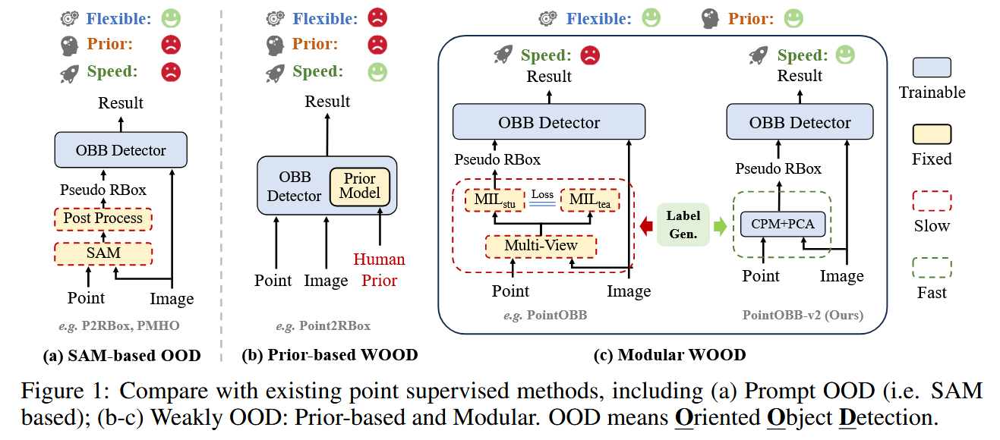
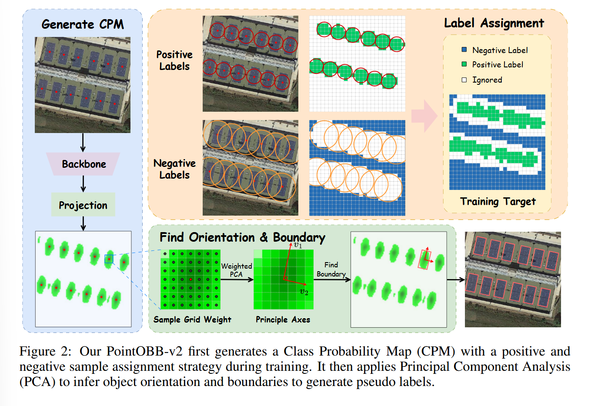

# 《POINTOBB-V2: TOWARDS SIMPLER, FASTER, AND STRONGER SINGLE POINT SUPERVISED ORIENTED OBJECT DETECTION》 略读

## 问题

点监督的性能、精度、速度和先验需求一致没有一个良好的平衡。本文提出 PointOBB-v2，把这些优点集中到了一起。

## 特点

相比起 PointOBB，v2 同样是解耦了 detector 和标签生成，大体结构一样，但是把 PointOBB 非常耗时的师生结构（MIL）换成了**CPM+PCA**，效率超高。

## 实现

### CPM

CPM 是反映某个类别存在于某个像素点的概率的图。
一个形状为$(C,H,W)$的图片，经过 backbone（带着 FPN 的 Resnet50）处理后，模型把金字塔最高分辨率的那一层拿出来开始操作。这一层会通过$Proj()$投影成一个由**训练集的目标类别数量**为第一维，第二第三维为特征图长宽的 tensor$(N_{class},H_0,W_0)$。在训练的过程中，$Proj()$会逐渐获得更好的获得 CPM 的能力。

### 标签分配

#### 正标签

以 GT 为圆心画圆，圆里面的点匹配为这个 GT 的正样本。
如果一个点在多个圆里面，就和最近的点匹配。

#### 负样本

还是画圆，外面的为负样本。
另外，为了应对密集场景，对每个 GT，找到和它最近的 GT，在两个 GT 的中点画圆。圆里面的点是负样本。（但是如果它本来就是正样本，就不会被覆盖）。

剩下的所有样本分配为忽略样本。

如上的标签分配一定会搞混一些正负样本，但是影响不大。

### PCA

其实直接对 CPM 进行特征值分解似乎也可以，但是这样是不稳定的，因为它不会直接提供几何形状和边界，而且会有背景噪声等问题。
对于每个 GT，使用加权的方式从图像采样一组网格点。采样方式：加权非均匀采样。

> 协方差矩阵是用于描述数据集中不同变量之间相关性和分布情况的矩阵，其中对角线元素表示变量的方差，非对角线元素表示变量之间的协方差。在 PCA 中，协方差矩阵用于提取数据的主要方向，通常通过特征值分解找到最大特征值对应的特征向量，从而确定数据的主方向。在 PointOBB-v2 中，协方差矩阵通过加权采样点计算，稳定地估计物体的方向，避免背景噪声干扰，提高计算精度和稳健性。

> 该过程基于类概率图中的概率分布，使用加权的方式来决定哪些点将被采样。与均匀随机采样不同，非均匀采样根据 CPM 中每个位置的概率权重进行采样，概率越高的点更可能被选中。这种采样方法的优势在于，它能够聚焦于物体的关键区域，并减少误采样。

> 论文非均匀采样的实现:
>
> > 对每个物体，在其 **GT** 周围构建一个 7×7 的网格。这个网格围绕标注点（即物体的中心点）生成一系列离散的采样点。这些采样点的位置通过一个网格坐标系统确定，网格的大小为 7×7，生成 49 个点，每个点的坐标是 (x, y)，其中 x 和 y 的范围是[-3, 3]。
>
> 加权采样:
>
> > 在这些网格点中，采样的概率是根据类概率图（CPM）中每个点的概率值来加权的。每个采样点的权重与其在 CPM 中对应的概率值成正比。
> > 这样，概率值较高的区域会被更频繁地采样，而概率较低的区域则会被较少采样。

如果按照上面的方式硬来，就成了“你概率越高我越可能采样你”，这种随机采样有可能产生乌龙。可以采样多次取平均，但效率不就下来了嘛。所以用一个等价手段，使用加权协方差矩阵的方式：
$$C_z = \sum_{i=1}^{N} p_i (z_i - \mu_z)^{\text{T}} (z_i - \mu_z)$$
其中：

$$
p_i：这个点属于中心点代表的GT的概率\\(z_i − μ_z)：衡量这个点离中心点有多远
$$

对$C_z$进行特征值分解，对应最大特征值的特征向量可以得到它的主要方向。

> 在 主成分分析（PCA） 中，协方差矩阵的特征值和特征向量用于找出数据中的主成分（即数据中方差最大的方向），从而将数据投影到这些主成分上，实现数据的降维。

$C_z$又是一个实对称矩阵，所以次级方向和主要方向是正交（垂直）的，刚好满足边界框两边垂直的性质。

之后，让两个向量沿着它们的方向平行滚动，通过是否低于 CPM 的阈值，确定边界。

### 分离机制（向量约束机制）

对于黏在一起的物体（密集场景），在 CPM 上很难区分，因此还使用了"Vector Constraint Suppression"的方法，解决边界歧义问题。
应当区分两个相邻物体，才能界定边界。对于每个 GT，找到和它最近的 GT，画一个向量。然后跟上面的主要方向/次级方向计算家教$u$。**如果**这个角度小于设定的阈值$\alpha$，**就要**用这个方向约束边界位置（因为在这种情况下，两个 GT 应该是边界框有边趋于平行的）。
公式：
$$u \cdot v_k < \frac{1}{2} \times d(\text{GT}_i, \text{GT}_j) \quad \text{if} \, \text{angle}(u, v_k) < \alpha$$
意思是让向量在滚的时候，不可以更靠近别人，而是要更靠近自己。

## 限制
非常稀疏的图，负样本分配策略会不好使，可能影响性能。
超参数不少，可能不同场景需要调整。