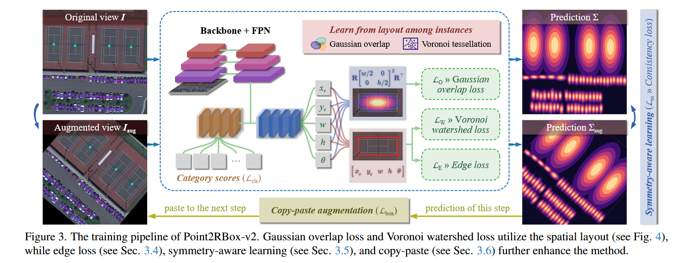
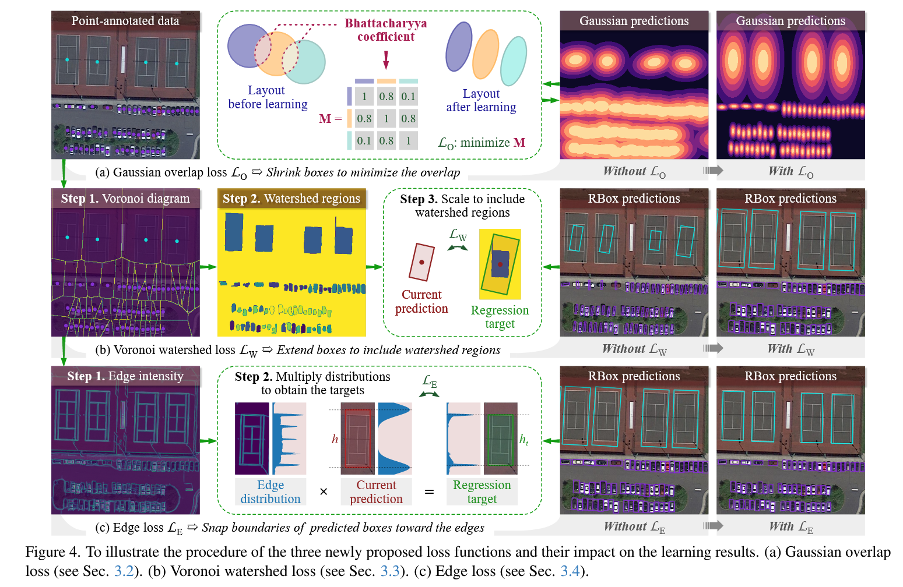

# 《Point2RBox-v2: Rethinking Point-supervised Oriented Object Detection with Spatial Layout Among Instances》阅读笔记

## 简介

《Point2RBox-v2》创新性地利用空间布局来学习物体边界。因为有向目标检测场景中大多数目标是不会重叠的，根据这个特性设计损失函数，架构新的网络。
论文使用的方式：通过高斯分布表示物体，然后通过缩小高斯重叠来为物体构建矩形框的上界；通过生成维诺图然后结合分水岭算法来为物体构建矩形框的下界。然后通过边缘损失精修旋转框。
另外保留了前作的旋转/翻转/缩放一致性的约束。还动态复制训练期间的高置信度预测框到新图中，增强密集场景的多样性（类似课程学习逐步强化困难样本的学习）。

## 实现

backbone: Resnet50
head: FPN
angle coder（角度编码）: PSC

点标注没有尺寸信息，所有把它们一股脑塞进 FPN 的 P3 层里面。

高斯表示：
对于一个预测出如下的旋转框的神经网络$f_{nn}(I)$

$$(x_c, y_c, w, h, \theta) = f_{\text{nn}}(I)$$
可以这样转化为$\mathcal{N}(\mu, \Sigma)$：

$$
\left\{
\begin{array}{l}
\mu = \left[ x_c \quad y_c \right], \quad \Sigma = \mathbf{R} \left[ \begin{array}{cc} w/2 & 0 \\ 0 & h/2 \end{array} \right]^2 \mathbf{R}^\top
\end{array}
\right.
$$

其中，

$$
\mathbf{R} = \left[ \begin{array}{cc} \cos \theta & -\sin \theta \\ \sin \theta & \cos \theta \end{array} \right]
$$

#### 三种损失的示意图如下

### 高斯重叠损失

**Bhattacharyya coefficient**：

$$
B \left( \mathcal{N}_1, \mathcal{N}_2 \right) = \exp \left( -\frac{1}{8} \mu^\top \Sigma^{-1} \mu \right) \cdot \frac{\left| \Sigma_1 \right|^{1/4} \left| \Sigma_2 \right|^{1/4}}{\left| \Sigma \right|^{1/2}}
$$

其中$\mu = \mu_2 - \mu_1$, $\Sigma = \frac{1}{2}(\Sigma_1 + \Sigma_2)$, $|\Sigma|$ 就是行列式。

这个公式可以用来衡量两个高斯分布的重叠程度。
因此，可以构造一个矩阵$\mathbf{M} \in \mathbb{R}^{N \times N}$，损失函数就由这个矩阵来定：

$$
\mathcal{L}_O = \frac{1}{N} \sum_{i \neq j} \left( \mathbf{M}_{i,j} \right)
$$

其中对角的元素不参与计算（自己和自己肯定是重叠啊）。

通过这个损失函数，高斯分布将会越来越不重叠。

### 维诺分水岭损失

如果仅通过上面的高斯分布损失约束，那旋转框就会不断变小（因为收缩得越小损失就越小）。所以还得约束下界。

#### 维诺图

整个平面基于$n$个点（GT），被划分为$n$个单元。任何一个单元的点，与该单元对应的 GT 的距离小于与其他所有 GT 的距离。这种图叫做维诺图。
Voronoi 图可以采用扫描线算法，在 $O(nlogn)$时间内使用 $O(n)$空间构造出来。

#### 分水岭算法

假设有一个山地地貌，下雨了，盆地会被水填上。在填上的过程中，不同的盆地的水会交汇到一起，交汇一瞬间接触的那条线就是“分水岭”。利用分水岭可以很容易划分不同的盆地。
类似地，标准的分水岭算法过程如下：将图片转化成一个灰度图，高亮度的是前景，低亮度的是背景。通过一系列转化，先过滤背景的噪点，腐蚀或者带阈值的距离变换得到必然前景，膨胀得到必然背景，把必然前景和必然背景去掉的地方是不确定区域。
分水岭算法之前需要标记。把不确定区域标记为 0，必然背景标记为 1，其它区域（连通块）用大于 1 的整数表示。标记之后跑一遍分水岭算法即可得到分水岭。

#### 维诺分水岭损失

维诺图恰好可以作为分水岭损失的输入。这里的分水岭算法和传统的不一样，仅仅是约束了实例的下界而非像素级分割。
维诺图首先确保实例之间的区域不重叠，其后分水岭算法在维诺图的基础上操作。维诺图已经做好了“降噪”的处理，点标注是必然前景，维诺图的边界是必然背景，维诺图的内部格子是不确定区域。点标注是起始生长点（下雨的地方）。

这样就得到了盆地。把盆地转一下，取它的 w 和 h。

$$
\left[ \begin{array}{c} w_t \\ h_t \end{array} \right] = 2 \max \left| \mathbf{R}^\top \left( S - \left[ \begin{array}{c} x_c \\ y_c \end{array} \right] \right) \right|
$$

把盆地平移到(0,0)后旋转，取最大的 x 和 y，就是预测框的半宽和半高，翻个倍设计损失函数就可以了。

$$
\mathcal{L}_W = L_{\text{GWD}} \left( \left[ \begin{array}{cc} w/2 & 0 \\ 0 & h/2 \end{array} \right]^2, \left[ \begin{array}{cc} w_t/2 & 0 \\ 0 & h_t/2 \end{array} \right]^2 \right)
$$

### 边缘损失

不过只有上下界，仍然只能得到粗糙的边界框。论文使用边缘损失来精修这个框。
$P = \text{RoIAlign} \left( E \left( I \right), \left( x_c, y_c, \beta w, \beta h, \theta \right) \right)$

$(x_c, y_c, \beta w, \beta h, \theta)$ 就是刚刚从上面预测到的旋转框。先用缩放因子$\beta$放大它（因为不确定这个框有没有把整个物体装进去）。论文使用的 $\beta=1.6$。

$E(I)$是一个边缘检测算法。

> 边缘检测的输出通常是一张“边缘图”——也就是一个单通道的图像，其中每个像素的数值代表该位置的边缘强度。换句话说，边缘检测会计算图像中各处的梯度或变化情况，输出一个显示边缘位置的灰度图，高值表示可能的边缘位置，低值则表示平坦区域。
> 在这个方法中，边缘检测函数 E(I) 就是将输入图像 I 转换成这样的边缘图，然后通过 Rotated RoI Align 在预测的 RBox（经过 β 缩放后）的区域内采样出固定尺寸的特征图 P，该特征图 P 就包含了对应区域内边缘强度的信息。这些信息随后被用来计算边缘分布，再帮助确定更精确的检测框尺寸。

然后计算两者之间的$\text{RoIAlign}$。其中采用的输出图像分辨率为$(2K+1)\times (2K+1)$。

先关注$h$的回归。
对$P$的每一行求和，得到分布：

$$
\mu_i = \sum_{j=1}^{2K+1} \left( P_{(K+1-i),j} + P_{(K+1+i),j} \right)
$$

这里 $i = 1, 2, \ldots, K$，相当于 P 的上半部分和对称的下半部分相叠加。这里是为了让边缘分布更加平滑。于是有了[这张图](#三种损失的示意图如下)中的边缘强度分布图。明显看到：越接近边界的地方，边缘强度越大。

另外论文用了$\lambda$来软化这个分布，用于减小噪声等（性质是越应当接近边界的地方权重越大）。通过将 $λ$ 与 $μ$相乘然后找最大值，作为回归位置。

$$
\lambda_i = \exp \left( -\frac{(i - K/\beta)^2}{2\sigma_E^2} \right)
$$

因为$\mu$其实已经提前被放在$i = 1, 2, \ldots, K$之间了，相当于从对称轴开始向上和下延伸。所以直接取$\argmax$就知道了它的$h$在这里实际上应该是多少。再映射回原图就可以了。
$$h_t = \frac{\beta h}{K} \arg \max(\mu \times \lambda)$$

损失函数使用 smoothL1。

$$
\mathcal{L}_E = \text{smooth}_{L1} \left( \left[ w \quad h \right], \left[ w_t \quad h_t \right] \right)
$$

### 对称性学习

因为对称学习很牛 B，所以理应把它迁移到高斯上。

$$I_{\text{aug}} = \alpha I$$

其中，

$$\alpha = \begin{bmatrix} \cos \mathcal{R} & -\sin \mathcal{R} \\ \sin \mathcal{R} & \cos \mathcal{R} \end{bmatrix}^{p_1} \begin{bmatrix} 1 & 0 \\ 0 & -1 \end{bmatrix}^{p_2} \begin{bmatrix} s & 0 \\ 0 & s \end{bmatrix}^{p_3}$$

其中，$(p_1, p_2, p_3) = 
\begin{cases} 
(1, 0, 0) & \text{旋转}, \\
(0, 1, 0) & \text{翻转}, \\
(0, 0, 1) & \text{缩放.}
\end{cases}
$
其它地方和以前的一致性损失一样，把高斯距离和角度损失加起来就行。角度损失还是用了防止角度周期性的 smoothL1。

### 复制粘贴

直接复制前一步检测出来的置信度高的实例，粘贴到下一步去。每一步最多弄 10 个。

## 更多

- 对港口、桥梁这类稀疏的或者难以被别的目标约束的目标表现比较差。（它们对于论文的空间布局方法几乎是无效的）
- 模型假设目标不重叠，但是训练后的网络还是可以预测重叠的目标，比如两个交叉放在一起的飞机。
