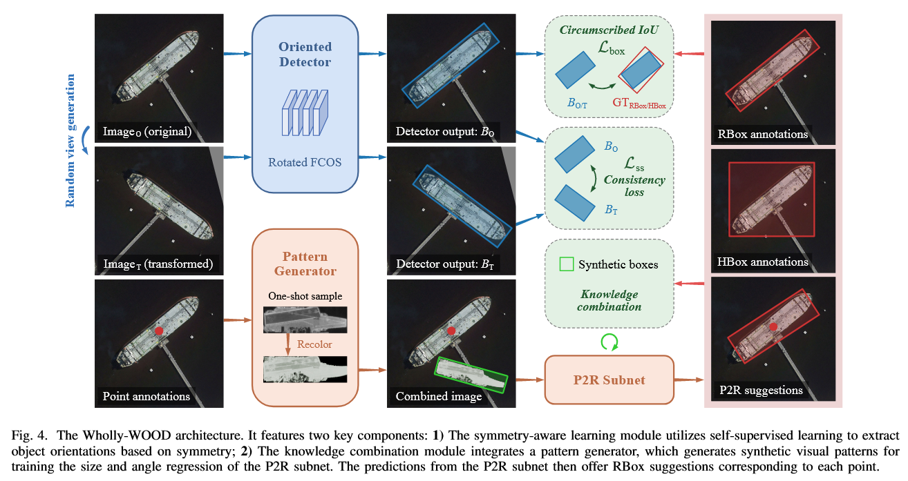
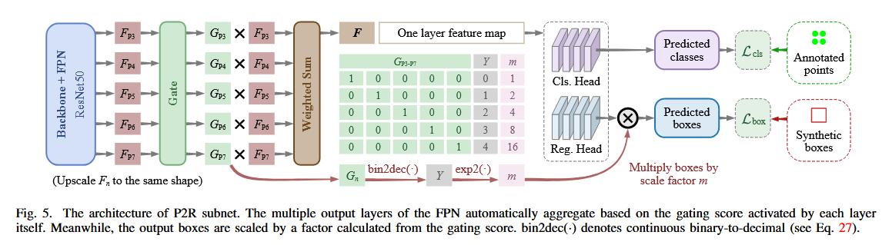

# 《Wholly-WOOD: Wholly Leveraging Diversified-quality Labels for Weakly-supervised Oriented Object Detection》阅读笔记

## 简介

~感觉就是把以前的成果缝合了一下。~
高情商：把以前的研究成果做了统一的整合，让模型能适应各种场景的应用。

## 实现

如图所示，Wholly-WOOD 根据输入的类型（点、水平框、旋转框）对它们进行不同的处理。其中只有 P2R Subnet 是新的。

### P2R Subnet

Point2RBox 中：

> 因为点标注没法提供尺寸相关的信息，所以 backbone 不能用 FPN-based 的 detector 作为 backbone。难得 YOLOF 是只使用一个级别的尺度特征，它使用尺寸 32, 64, 128, 256 和 512 的锚框，它自己的锚框分配逻辑还是不能用。所以只能自己制定分配策略。
> 用 YOLOF 作为 backbone，但是把它的所有五种 anchor size 调到同一个值（DOTA 是 64，别的是 128），但是 anchor size 不减少。（减少的话会掉点）

但是这样做会掉效率。所以弄了个 P2R Subnet 解决这个问题：

它的主要作用是把 FPN 的多层金字塔合为一体，形成一个单层特征图结构。步骤如下：

1. **计算 Gating 分数**
   _（Gating 分数表示对于每一处特征，这一层融合的时候的重要程度）_
   \[
   G_n = \text{softmax}\big(\text{conv}(\text{interp}(F_n))\big)
   \]
   其中：

   - **\(F_n\)** 表示第 \(n\) 层 FPN 特征。
   - **interp(\(F_n\))**：将该层特征上采样到与最低分辨率层相同的尺寸。
   - **conv(·)**：通过一个 3×3 卷积提取单通道信息，得到一个“评分图”。
   - **softmax(·)**：在所有 FPN 层上进行归一化，使得在每个像素位置，各层的权重和为 1。

2. **融合多层特征**

   $$F = \sum_{n=1}^{N} G_n \cdot \text{interp}(F_n)$$
   将上采样后的每个 FPN 层特征乘以对应的 gating 分数 \(G_n\)，再将所有层相加。

   融合后的特征图 \(F\) 同时包含了低层细节和高层语义信息，这种自适应加权能够让网络更好地处理不同尺度的目标。

3. **尺度因子的计算**
   解码尺度信息：
   $$Y = \frac{N}{2\pi} \left( \pi - \arctan \frac{\sum_{n=1}^{N} G_n \sin \left( 2\pi \cdot \frac{n-1}{N} \right)}{\sum_{n=1}^{N} -G_n \cos \left( 2\pi \cdot \frac{n-1}{N} \right)} \right)$$
   **基本思想**：这是一个二进制解码器，把 n 位二进制解码成连续光滑的十进制表示$Y$。在《_On Boundary Discontinuity in Angle Regression Based Arbitrary Oriented Object Detection_》出现过。
   这个公式的目的是把各层的 gating 分数“解码”为一个数值 \(Y\)，它反映了各层在尺度信息上的综合“意见”。可以把这个过程想象为利用圆周上的角度加权平均，得到一个代表“尺寸倾向”的值。

4. 最终框预测

$$
B_{\text{pred}} = m \cdot \text{conv}(F)
$$

其中，尺度因子 \(m\) 定义为：
\[
m = 2^Y
\]

**解释：**

- **conv(\(F\))**：将融合后的特征图 \(F\) 经过一个卷积层，预测出一个基础框（包含宽、高等信息）。
- **尺度因子 \(m = 2^Y\)**：将上一步得到的综合尺度信息 \(Y\) 转换为放大或缩小的倍数。

**作用：**  
将基础预测结果乘以 \(m\)，可以动态调整预测框的大小，使其适应不同尺度的目标。这样即便只有点标注，也能根据融合特征“判断”出目标应有的尺寸。
