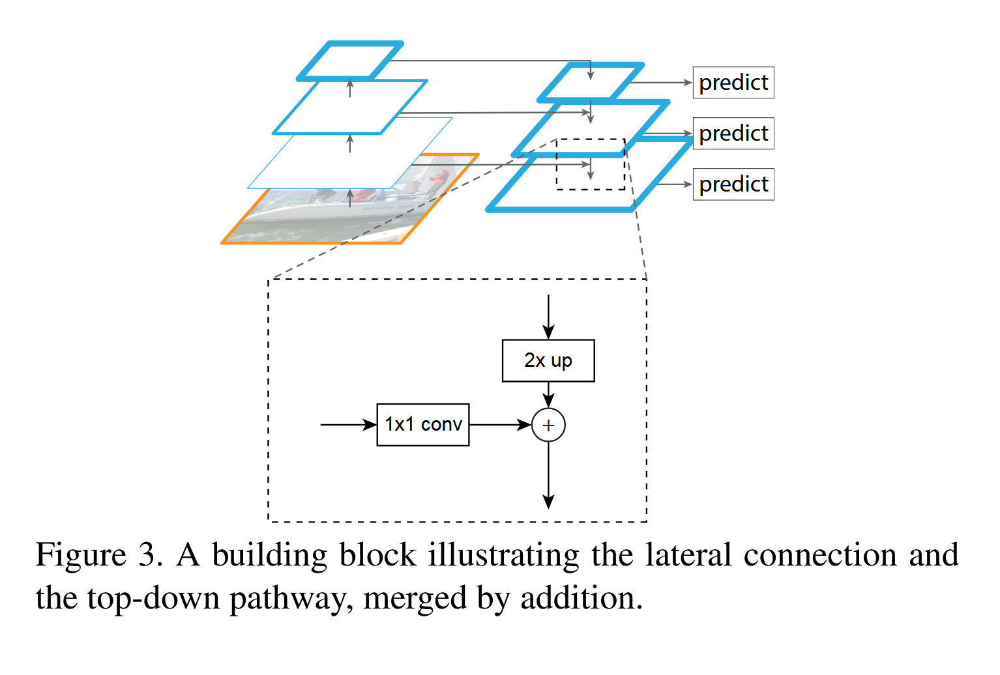

# 《Feature Pyramid Networks for Object Detection》阅读笔记

## 简介

多尺度目标识别是 CV 方面的难题，FPN 的提出是为了解决这个问题的。早期的目标检测系统实现多尺度用的是图像金字塔分别提取特征，成本太高，所以很多深度学习目标检测网络都避免使用它。Faster R-CNN 这种网络预先设定多尺度锚框，但是因为单层特征图的特性损失了多尺度信息。
FPN 是一种横向连接的自顶向下架构，利用了深层卷积网络的多尺度、金字塔层级结构构建特征金字塔，用于构建所有尺度下的高特征特征图。

> 特征信息越丰富，看到的细节就越多。深层的卷积层因为经过很多的卷积和池化，感受野大，所以看到的东西更加“宏观”，相应地就可能导致了细节的丢失。

## 背景

处理多尺度信息，在图像金字塔中提取特征，构成特征金字塔是基本而传统的做法。金字塔赋予模型尺度不变性，而且所有层次都有强特征性。
但是这种做法太慢了。所以 Faster R-CNN 就用单尺度特征图快速检测。
还有另外一种做法是用卷积神经网络内部的各个特征层次直接预测，例如 SSD。

> 卷积网络的浅层分辨率高，细节强，语义信息弱；深层分辨率低，细节弱，语义信息强。
> SSD 处理小物体时，可能在深层网络中因为分辨率低而丢失特征。为了避免使用特征信息弱的部分，它从高层特征开始构建金字塔再额外增加几个新的层。既增加成本又浪费了浅层的计算结果。

由上，FPN 的目标就是充分利用卷积网的层次结构创建特征金字塔，并且保证在所有尺度下的特征都具有强特征。那我们就要取长补短，把低分辨率强特征和高分辨率弱特征结合起来。
FPN 的网络结构示意如下。

其中左边的 Top 结构仅仅在最高分辨率层（最底层的、宏观的层面）预测。右边的 Bottom 结构（**FPN 采取的结构**）把它改造成了“特征金字塔”，每一层都会做出预测。

## 实现

卷积网络的特性是由浅到深细节递减语义递增。FPN 需要构建一个含有高级语义的特征金字塔。
这个特征金字塔网络对于所有卷积网络都是通用的。本文研究重点是以 RPN 为代表的滑动窗口区域建议和以 Fast R-CNN 为代表的目标检测。

- 自底向上
  卷积网络中的一部分层会输出同一个 size 的输出，我们规定它们为同一个 stage。
  我们取同一个 stage 的最后一层的输出作为特征提取的层（很明显计算越多特征越显著）
  实验中第一个 stage 的不取，因为经过降采样太少，内存占用太大。

- 自顶向下
  从低分辨率高语义的特征图开始，将它的空间分辨率上采样提升 2 倍（使用最近邻上采样）。然后将它和相应的自底向上特征图通过如图的形式相加合并。
  

## 应用

FPN 在深度卷积神经网络中构建特征金字塔是通用的方法。论文在 RPN 和 Fast R-CNN 上面做了示范。

### RPN

将 RPN 生成单一尺度特征图的部分替换成 FPN 来适配 RPN，在特征金字塔的每一层的头部附加 3×3 卷积和两个并行的 1×1 卷积（**这些头部的参数要共享**），这样就可以替代 RPN 的多尺度锚框的处理。在每一个层级上面分别固定定义锚框的面积，如论文*在{P2, P3, P4, P5, P6}上分别定义锚框的面积为{32², 64², 128², 256², 512²}像素*。然而多种宽高比还是需要的。论文用了{1:2, 1:1, 2:1}三种。
根据 IoU 分配训练标签。规则和 Faster R-CNN 中的一模一样。但是我们不根据真实框的尺度把真实框分配到金字塔中，而是和各个层级（代表各个尺度）的锚框关联。

### Fast R-CNN

前面提到这个网络上使用 RoI 池化提取特征的。普通的 Fast R-CNN 是在单一尺度的特征图上面跑的。
为了结合 FPN，需要把不同尺度的 RoI 分配到金字塔的不同层级。
将宽度为\(w\)、高度为\(h\)的 RoI 分配到特征金字塔层级\(P_k\)的公式为：

$$
k = \lfloor k_0 + \log_2(\sqrt{wh}/224) \rfloor
$$

224 是 ImageNet 的预训练图像的尺寸。$k_0$是希望将$wh=244^2$的 RoI 映射到的目标层级。论文参考 Faster R-CNN，将$C_4$作为单一尺度的特征图，所以令$k_0=4$。
在这个公式下，RoI 尺度越小，映射到的层级越高（需要更高分辨率的层级的特征）。
所有层级的 RoI 上都附加上预测头部，**头部的参数仍然是共享的**，作为分类器和框回归器。
