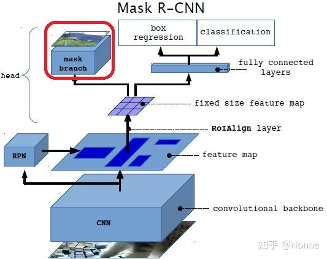

# 《Mask R-CNN》阅读笔记

## 简介

Mask R-CNN 可以有效检测图像中的物体并且为每个 instant 生成分割它们的 mask。
Mask R-CNN 采用的是 Faster R-CNN 的结构。在其基础上加了一个 FCN。
它的功能相较于 FCN，新增了实例分割。例如：两只猫贴贴，Mask R-CNN 只知道这一坨像素都是猫，并不知道这些像素属于哪只猫；但是 Mask R-CNN 可以。

## 背景

Faster R-CNN 可以进行目标检测（用水平框圈出目标物体），FCN 可以进行像素级别的语义分割分割（分辨每个像素属于什么类别），那可以把它们结合起来，生成能够截取每个目标的 Mask！
即：Mask R-CNN=Faster R-CNN(_object detection_)+FCN(_semantic segmentation_)
然而，Faster R-CNN 的 RoI Pooling 层并不是为像素级分割设计的，它的取整操作对于像素级预测存在量化上的问题。为了解决这个问题，Mask R-CNN 提出了新的池化层，叫做 RoIAlign。
另外，Mask R-CNN 解耦了 mask 和分类的预测，否则它们会互相干扰。（FCN 中的 mask 和分类是耦合的）

## 实现

实际上，Mask R-CNN 仅仅只是在 Faster R-CNN 的每个 RoI 上额外添加了一个 FCN 用来预测 mask 的分支。它和分类与边界框回归是并行的关系（_注意，这里的 mask 和分类的预测是分离的，而以往的都是结合在一起的。_）。而这个小型的 FCN 开销实际上很小。
结构如下：

训练时， 对于每个 RoI，定义其多任务损失为$L = L_{cls} + L_{box} + L_{mask}$
mask 分支的最终输出是一个$K×m^2$的张量，表示$K$类分辨率为$m×m$的 mask。对于每个类别，每个$m×m$的 mask 是一个二值的矩阵，表示该类别是否属于该像素。
计算损失时，对于属于类别 k 的 RoI，仅关心第 k 类的结果。损失函数**分别单独**对每一个类别的 logit 使用 sigmoid 将输出值映射到$[0,1]$，然后定义$L_{mask}$为所有像素的平均二元交叉熵损失。

> 这里运用 sigmoid 和传统的 softmax 的区别：
> 传统的 softmax 会计算 $softmax\{[猫得分，狗得分，背景得分]\}$，所以其中一个类别概率大会压制其他类别，产生竞争；
> 但是这里 sigmoid 会对每一个类别单独处理，生成一个$m\times m$的概率图来表示每个像素属于此类的概率

如上，我们预测的时候不需要类别预测模块的输出，也不存在不同类别之间的竞争，即实现了解耦。

图像的 mask 表示不使用 FC 层，而是使用 FCN 从 RoI 中预测出$m\times m$的 mask。既不会折损空间信息，也更加快。
然而，FC 层精确到像素的特性需要在池化缩放的时候有良好的对齐，传统的 Fast R-CNN 框架并没有考虑这点。所以 Mask R-CNN 提出了 RoIAlign 层满足这个需求。

**RoIAlign**

上图的虚线网格是特征图，实线框是 RoI 映射到特征图上的样子。在普通的 RoI 中，我们直接取整，分割的时候也直接取整。这对于像素级别预测肯定是不及格的。
RoIAlign 弃用了上述的操作。首先，按照期望的输出大小（如$2\times 2$）将 Proposal 平均划分，根据 sample_ratio 在每个子区域里面设置若干个采样点（论文设置为 4），然后对于每个采样点，利用双线性插值计算它的值，再和池化一样计算它的最大值或者平均值。

对于不同的 backbone，发现 Mask R-CNN 同样有效。其中 Resnet-FPN 和它的结合最好。
另外，带有 FPN 和不带有 FPN 的 Mask branch 的处理是不一样的。

