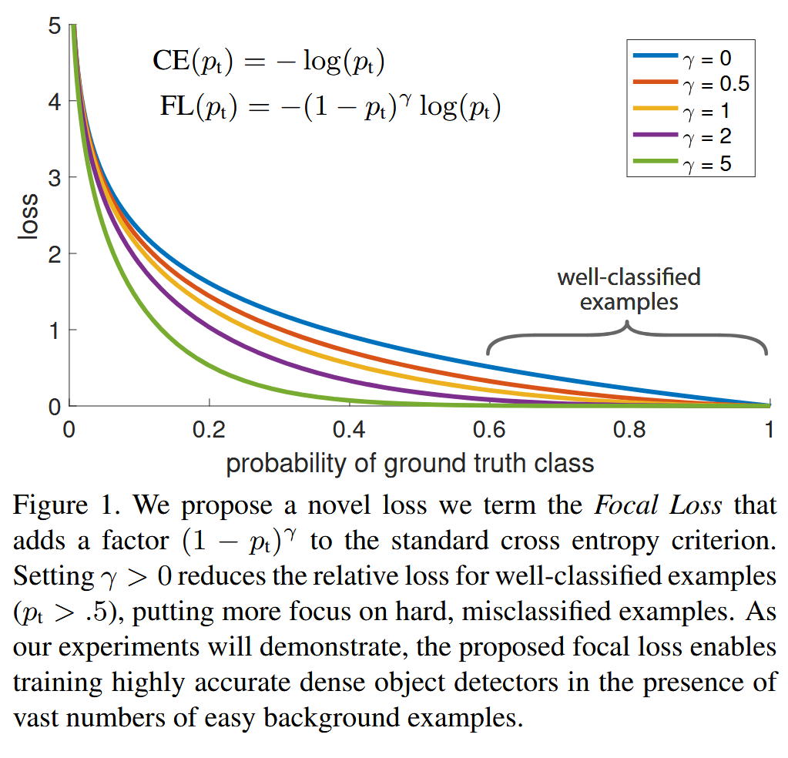
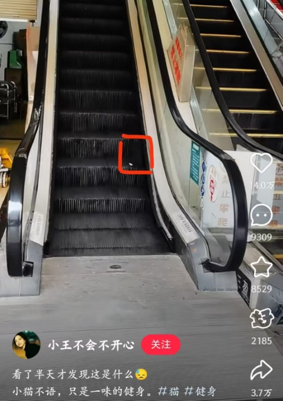
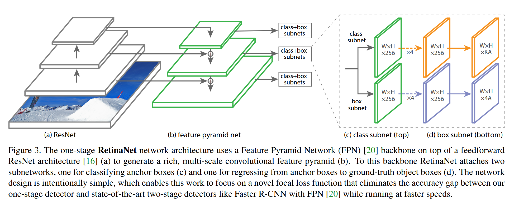

# 《Focal Loss for Dense Object Detection》（RetinaNet）阅读笔记

## 简介

RetinaNet 通过改进 Loss 函数，解决了单阶段方法在前景和背景的极端不平衡问题，消除了单阶段方法在目标检测中的精度劣势，甚至能够超越现有的双阶段方法。

## 背景

R-CNN 这种两阶段方法在目标检测中一直拥有比单阶段方法更高的 accuracy，通常用于稀疏目标检测。而对于密集的目标，一般使用单阶段方法，它们更快更简单（成本更低）。但是单阶段方法的 accuracy 仍然是个问题。

> SSD 和 YOLO 就是经典的单阶段检测器。它们牺牲了精度换取效率。
> 类别失衡：单阶段检测方法广泛的问题。训练阶段，SSD 等检测器对每个图像都评估$10^4$~$10^5$个位置，然而这些位置有大量的背景，仅有少部分包含目标，而且目标里面又有 hard samples（难以检测的样本）。因此，大量重复的简单的负面样本浪费了训练资源，并且在训练中占有过分的主导地位。常见的解决方案是 hard negative mining 去采样 hard samples。

## 实现

作者发现精度低下的根本原因是类别失衡。所以作者将交叉熵误差函数改进为 Focal Loss。

经典的 CE loss 公式为：

$$
\text{CE}(p, y) =
\begin{cases}
-\log(p) & \text{if } y = 1 \\
-\log(1 - p) & \text{if } y = 0
\end{cases}
$$

其中：

- \( y \) 是真实标签（\( y = 1 \) 表示正类，\( y = 0 \) 表示负类）。
- \( p \) 是模型预测为正类的概率（\( p \in [0, 1] \)）。

为了简化公式，可以引入 \( p_t \) 表示模型对真实类别的预测概率：

$$
p_t =
\begin{cases}
p & \text{if } y = 1 \\
1 - p & \text{if } y = 0
\end{cases}
$$

此时，交叉熵损失可以统一写成：

$$
\text{CE}(p_t) = -\log(p_t)
$$

CE loss 有一个巨大的问题：对于 easy samples($p_t \gg .5$)，它们仍然会产生很大的损失。easy sample 太多时，小的损失值会被淹没。如图中蓝色的曲线所示。

> hard samples 本身就难被预测，所以预测概率也会很小，损失就会被淹没。像下面这只猫，模型会对自己检测出来的结果毫无信心。

<figure>
  
  <figcaption style="color: gray;"><small>猫猫：模型好不容易勉强把我检测出来，却没信心让我贡献损失……</figcaption>
</figure>

### Balanced Cross Entropy

引入加权因子$\alpha$，对少数类别赋予大权重$\alpha$，多数类别赋予小权重$1-\alpha$。改进后的公式可以表示如下：

$$
\text{CE}(p_t) = -\alpha_t \log(p_t)
$$

其中：

- \( p_t \) 是模型对真实类别的预测概率。
- \( \alpha_t \) 是权重因子，定义如下：
  $$
  \alpha_t =
  \begin{cases}
  \alpha & \text{if } y = 1 \\
  1 - \alpha & \text{if } y = 0
  \end{cases}
  $$

### Focal Loss 定义

虽然$\alpha$的引入平衡了正采样和负采样，但是还是没有拯救 hard samples 被忽视的问题。
所以，我们要把训练集中在 hard samples 上。添加一个调节因子$(1-p_t)^\gamma$，其中$\gamma$是超参数。focal loss 公式如下：

$$
\text{FL}(p_t) = -(1 - p_t)^\gamma \log(p_t)
$$

再次观察图片。

- **当样本分类错误时**：

  - 此时模型对真实类别的预测概率 \( p_t \) 较低（例如 \( p_t = 0.1 \)）。
  - 调制因子 \( (1 - p_t)^\gamma \) 接近 1，因此 Focal Loss 几乎不受影响，与交叉熵损失（CE Loss）接近。

- **当样本分类正确时**：
  - 模型对真实类别的预测概率 \( p_t \) 较高（例如 \( p_t = 0.9 \)）。
  - 调制因子 \( (1 - p_t)^\gamma \) 接近 0，因此 Focal Loss 被大幅降低。
  - 例如：如果 \( p_t = 0.9 \)，\( \gamma = 2 \)，则 \( (1 - 0.9)^2 = 0.01 \)，损失缩小了 100 倍。

很明显，$\gamma$越大，对 easy samples 的抑制作用越大，模型越聚焦于难分类样本。
实践中，我们可以保留上述的$\alpha$，可以提高精度。

$$
\text{FL}(p_t) = -\alpha_t(1 - p_t)^\gamma \log(p_t)
$$

### 类别失衡与模型初始化

二分类模型的默认初始化认为输出$y=+1$和$y=-1$的概率是相等的。然而在我们类别失衡的前提下，这种初始化是不行的，会导致频繁出现的类别（频繁类）主导总损失，把出现少的类别（稀有类）的生态位占领了。

> Sigmoid 函数接受输入为 0 时输出接近 0.5。训练初期，随机初始化的模型参数对所有样本的输出都接近 0，于是预测概率都接近 0.5。由于频繁类的频繁出现，在个体损失均等的前提下，频繁类的损失会远远高于稀有类。

我们引入一个“先验概率”$\pi$来让稀有类的地位提高，使得模型对稀有类（正类）的预测概率接近一个小值 $\pi$ （例如修改模型输出前的偏置 b）。

> 我们可以假设没有偏置时输出为 0，那么模型输出层的输出就是 b。代入 Sigmoid 的公式，再令它与$\pi$相等，解得 b。

**这里仅仅是对模型的初始化产生了调整**，提升了训练稳定性。

### 类别失衡与两阶段检测器

两阶段检测器解决类别失衡的方法的方法：

1. RPN 等方式选择 Proposal 并且运用 NMS 筛选，降低了候选框数量到 1-2k，并且消除了大量的 easy negative（背景区域）。
2. 对于每个 mini-batch 采样，强制保持正负样本比例固定。

## RetinaNet

RetinaNet 的网络构造和前面几篇论文的构建思路没有区别。网络图如下：

锚框的设置和 FPN 下的 RPN 很像。但是论文对每种额外增设了三种不同的纵横比的锚框 $2^0, 2^{1/3}, 2^{2/3}$。这样训练出来的精度更高。
