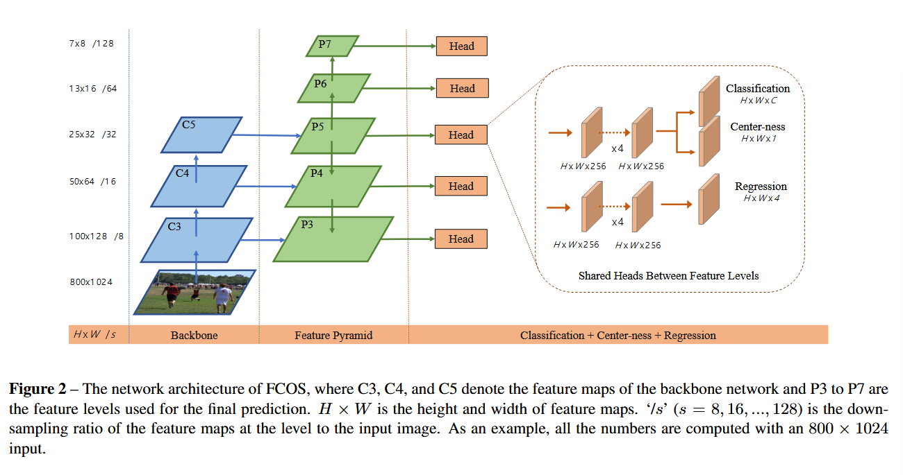

# 《FCOS: Fully Convolutional One-Stage Object Detection》阅读笔记

## 简介

FCOS 是一个全卷积单阶段检测器，在像素级别检测对象，达成类似语义分割的效果。它最大的特点在于直接抛弃了之前经典目标检测网络都在用的 anchor，也抛弃了 proposal，因此和 anchor 处理相关的问题自然被解决了，包括 anchor 的尺度、长宽比等超参数对模型性能的巨大影响。它不仅简单，而且性能超越了以往所有单阶段检测器。

## 背景

以往的对象检测一直拘束于用 anchor 得到感兴趣实例的边界框，但是 anchor 的机制有一些致命的缺点。

1. 模型性能对超参数非常敏感；
2. anchor 尺度和长宽比不可变导致模型对形状差异大的图片表现差，而且泛用性减弱（对于对象大小和长宽比有变化的检测任务需要重新设计超参数）；
3. 需要密集标注锚框，大多数锚框被标记为 negative samples 导致正负 samples 数量不平衡；
4. 涉及计算 IoU 等复杂计算。

FCN 在 CV 领域被广泛应用——语义分割、深度估计、关键点检测、物体计数……这么多的任务，就是没有 object detection，因为 FCN 并不带有锚框设计。那能不能改造一下，让 object detection 摆脱锚框的束缚，适应 FCN？一些如 DenseBox 的检测器尝试使用 FCN 框架做对象检测。但是它们并没有解决一个很尴尬的问题：如果目标的边界框高度重叠，那回归目标就不明确了。而 FCOS 解决了这个问题。

YOLOv1 曾经实现了无锚框检测器。它不使用锚框，而是使用对象的中心附近的点来预测边界框，结果召回率太低，YOLOv2 又采用锚框了。CornerNet 也是无锚框检测器，但是它需要复杂的后处理和额外的学习。

## 实现

### 全卷积单阶段目标检测器

定义$F_i\in \R ^{H×W×C} $为第 i 层的特征图，s 是到这一层的总 stride，GT用$\{B_i\}$定义,其中$B_i$是边界框左上角、右下角坐标和 GT 目标类别。

核心是把特征图映射到原图上。映射公式为：
\[
(x,y) →
(\left\lfloor \frac{s}{2} \right\rfloor + x \cdot s,  
\left\lfloor \frac{s}{2} \right\rfloor + y \cdot s)
\]
其中：

- \( s \) 是从输入图像到特征图 \( F_i \) 的总步长（即下采样率）。
- \( \lfloor \cdot \rfloor \) 表示向下取整。因此会有一定的偏移。

这个位置表示原图像的（接近）感受野的中心。在 anchor-based 检测器中也是一样，但是 anchor-based 检测器会把它视为锚框的中心，为边界框回归设置大量的锚框。但是 FCOS 在映射后直接回归目标框（直接把这个位置当做训练样本输入）。

> 直接用位置进行回归，用于语义分割的 FCN 也是这样的原理。

对于每个$(x,y)$，在映射之后如果落到 ground truth（GT）中，就把它看成正样本，并且把 GT 的类别分配给这个点。否则就是负样本。
但是这又有一个问题了——比如说我抱着一只猫，那这个点会同时落在我的框和猫的框里面。那么它就是*ambiguous sample*。FCOS 的策略是选择最小区域的边界框作为它的回归目标。后续的训练显示，这种样本数量会显著减少。
除了分类，还有一个四维向量$t^*$，用来记录到 GT 框的上下左右边界的距离。

上述的策略会把尽量多的前景目标纳入训练，而不是像 anchor-based 一样只有和 GT 有足够高的 IoU 才纳入训练。作者认为这是 FCOS 优秀表现的原因之一。

- **网络的输出**
  主干网络的输出层输出：
  **一个 80D 的向量$p$**（对应 COCO 训练集的 80 个类别）用于类别检测；
  **一个 4D 的向量$t$**（左上右下的距离）用于位置回归。
  FCOS 不训练多类别分类器，而是训练$C$个二元分类器。分别在两个检测分支之前各添加了四个卷积层。
  显然，FCOS 的主干网络输出是以往的 anchor-based 的网络的 1/9 大小。

- 损失函数
  其实和以前的长得差不多。

  $$
  \mathcal{L}_{\text{total}} = \frac{1}{N_{\text{pos}}} \left( \sum_{x,y} \mathcal{L}_{\text{cls}} + \lambda \sum_{x,y} \mathbb{I}_{\{c^*>0\}} \mathcal{L}_{\text{reg}} \right)
  $$

  $N_{pos}$是正样本的个数，前者是 focal loss，后者是 IOU Loss。
  **然而查阅代码发现里面是添加了中心度损失的。中心度损失下文会提及。**

- 推理
  网络输出是分类分数$p$（取分数大于 0.05 的）和针对特征图上的位置预测$t$。我们之前对训练期间的 $t$ 的定义是它到左上右下真实框的距离，将定义式移项即可。

### FPN 多尺度预测和 FCOS 的结合

两个隐患：

1. CNN 的大 stride 可能会导致召回率（BPR）相对较低。anchor-based 通过降低 IOU 阈值来弥补召回率。但 FCOS 并不怕低召回率。
2. GT 框重叠的时候如何回归？FPN 的多尺度可以弥补这一点。

作者直接限制了金字塔上每个级别的边界框的回归范围。因为一般重叠的都是不同尺度的物体（比如人抱着猫）。假如在这个原则下仍然有不止一个 GT 框和它关联，就取面积最小的 GT 框就可以了。

不同级别之间的网络头部仍然是共享的。但是对不同特征头部理应使用不同的特征级别，所以 FCOS 使用了可以自动调整特征级别的$\exp(s_ix)$。

### 中心度

做完上述的工作，FCOS 还是不如 anchor-based 的检测器。作者观察网络输出发现是因为远离物体中心的位置也产生了很多低质量的预测边界框。所以我们添加一个中心度检测分支**与分类分支并行**，它们的结果相乘作为真实的损失。

这个是公式：

$$
\text{centerness}^* = \sqrt{ \frac{\min(l^*, r^*)}{\max(l^*, r^*)} \times \frac{\min(t^*, b^*)}{\max(t^*, b^*)} }
$$

为什么要放在分类分支并行，而不是放在位置回归呢？因为这个中心度实际上需要决定这个框的“质量”，让低质量的框在 NMS 被过滤掉。
然而，回归需要的是精确的几何信息，中心度和分类需要的是全局质量评估。这两种预测器的性质不一样。消融实验中也提到了，可以直接用预测的回归向量计算中心度而不引入分支，但是结果显示没法提高性能。
