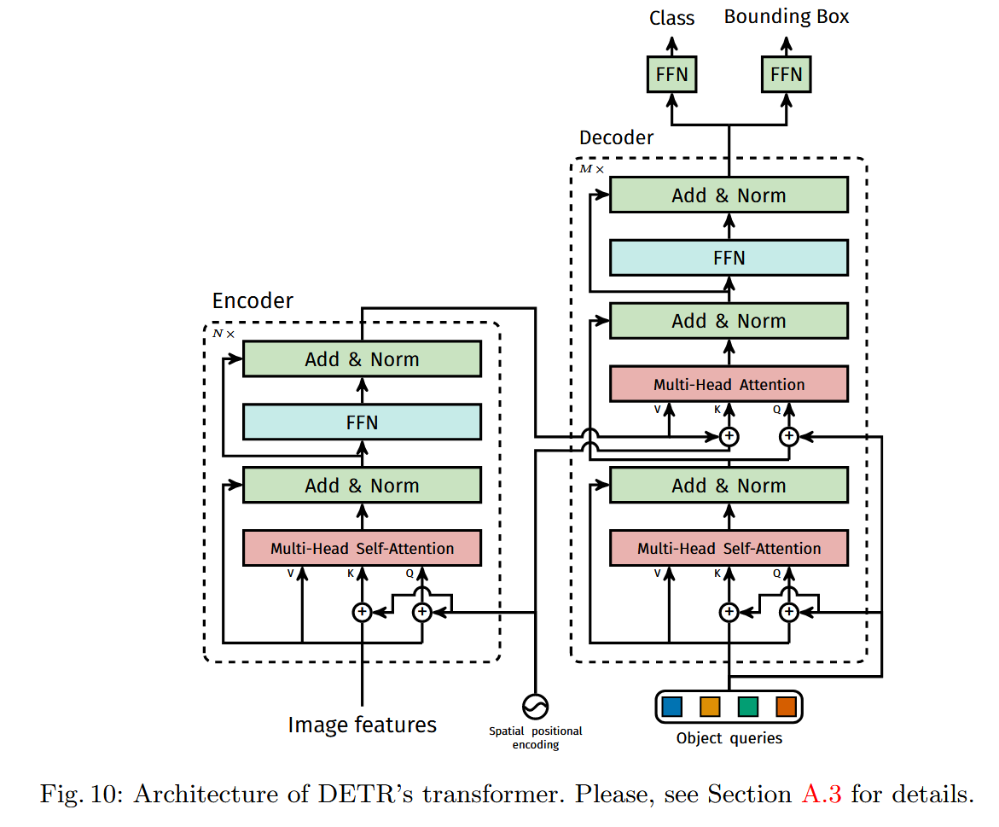

# 《End-to-End Object Detection with Transformers》阅读笔记

## 简介

DETR 是一种将 Transformer 的架构运用到目标检测领域的方法。它不依赖任何间接的手工设计组件（anchor, regional proposal, NMS 等），而是通过端到端的方案生成预测结果，即直接输出一组固定数量的带类别预测的预测框。
DETR 引入了一种叫 object quries 的工具。它可以自行学习空间位置分布规律替代锚框。模型强制固定它的数量 N（最大检测数），模型就输出 N 个预测，然后通过二分图匹配筛选有效目标。

## 背景

OD 的目标，归根到底就是预测一些边界框，并且标注它们的类别。DETR 指出目前 OD 的方法都是"indirect"的，因为它们的方法无一不能避免先生成 **region proposals（Faster R-CNN）, anchors（RetinaNet）, windows centers（FCOS）**，然后再通过上述这些东西进行回归和分类。其中会经过 NMS 等后处理（postprocessing）操作把预测工具和 GT 匹配，而这些操作需要许多手工调参，如锚框长宽比组数，而且这些都会显著影响性能。

DETR 规避了这些需求，形成了一种“真正的端到端”的方法。通过 Transformer 的编码器-解码器结构直接输出预测框集合，利用自注意力机制建模全局关系，并用二分图匹配损失函数将预测与真实框唯一匹配。该方法简化了检测流程，无需后处理步骤。

## 相关工作

1. 集合预测
   集合预测直接预测无序集合，缺乏传统深度学习方法；元素之间的结构关系（重合框等）无法处理。
   对于重复预测，传统方法通过 NMS 解决，DETR 通过对整张图片的整体推理让元素交互，消除冗余。采用 Transformer 实现**并行解码**，避免序列生成的住步骤依赖。

2. Transformer 与并行解码
   Self-Attention 机制从全序列聚合信息，并行更新所有元素，对长序列任务效果好。

## 实现

直接预测目标集合需要两个工具：一个能够匹配预测和 GT 的全新的 Loss；一种可以直接预测一组对象并且建模这些对象的关系的神经网络结构。

### OD 的损失函数

训练期间，对 decoder 单轮输出，DETR 预测了一个集合，里面有 N 个对象。其中 N 一定要远大于需要预测的对象。如何衡量这个集合的损失呢？

DETR 的整体预测流程如下。N 个输出中，超出实际目标数的部分使用$\empty$填充。预测和 GT 通过**匈牙利算法**匹配，然后计算匹配上的损失。

> 匈牙利算法的复杂度为 O(N^3)，只能用在 DETR 这种输出很少的结构上面。倘若用在 Faster R-CNN 这种模型上，会变得很慢。

真实框和预测框的匹配代价：先把真实框和预测框用匈牙利算法一一对应，然后分别计算所有非$\empty$对象的类别代价（预测类别概率的负值）和边界框代价（位置差异），相加。
匈牙利损失（最终损失）： 3. 匈牙利损失（最终损失）
匹配完成后，对已匹配的预测计算最终损失：

最终损失为匈牙利损失：

$$
\mathcal{L}_{\text{Hungarian}}(y, \hat{y}) = \sum_{i=1}^N \left[ -\log \hat{p}_{\hat{\sigma}(i)}(c_i) + \mathbb{1}_{\{c_i \neq \varnothing\}} \mathcal{L}_{\text{box}}(b_i, \hat{b}_{\hat{\sigma}(i)}) \right]
$$

分类损失使用负对数似然（\( -\log \hat{p} \)），增强错误分类的惩罚。
对 \( c_i = \varnothing \) 的损失项降权（因子 10），缓解类别不平衡。
对边界框损失，组合 L1 损失与 GIoU 损失，解决尺度敏感问题。

### DETR 的架构

CNN 作为 backbone 提取特征图，和 positional encoding 一起输入 Transformer encoder，再流入 Transformer decoder。DETR 的 Transformer decoder 并不使用 Mask。

Decoder 的输入是 N 个可学习的 object queries。有以下特征：

1. 无序（顺序不敏感，变化顺序不会改变语义）
2. 独特语义（单个 object query 的语义独特，不同的 object query 会关注不同的目标）
   同时，Cross-Attention 也让不同的 queries 之间相互关注，让它们不会重复预测。
   （它的地位类似于 RPN）

后续，Decoder 得到的信息会通过以下的 FFN 被转化为携带类别信息的边界框预测。

**FFN**（Prediction Feed-Forward Networks）是输出检测结果的模块，将 Decoder 的输出转化为具体结果。
三层感知机输出归一化的边界框坐标，单独的线性层输出类别概率。

这里很特别的是，传统检测头是预测偏移，而 FFN 直接得到绝对坐标。传统检测头通过 NMS 去冗余，而 FFN 直接用二分图匹配去冗余。

## 不足

DETR 的劣势很明显：

1. 对小目标不敏感（单尺度）
   原因：encoder 输入的时候进行下采样，细节丢失严重；全局的注意力难以捕捉小目标。
2. 训练周期长，难以收敛
   原因：transformer 就是这样的；匈牙利算法训练初期不稳定（因为 object queries 的随机性），收敛更慢。
3. 贵
   原因：transformer 就是这样的。
4. N 需要手动定义固定数量，而且需要远大于目标数，导致大量的$\empty$被浪费。
5. 位置编码和传统文本 Transformer 一样，可能对某些特殊目标不靠谱。
6. 损失函数仍然有分类和回归损失的超参数，调整敏感。

DETR 的局限性很强。遥感等场景下，我们仍然广泛使用 R-CNN 这种传统架构。
