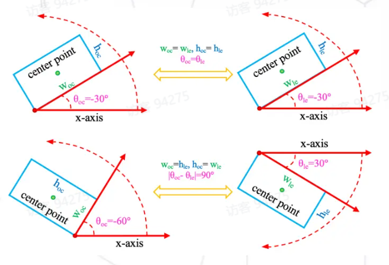
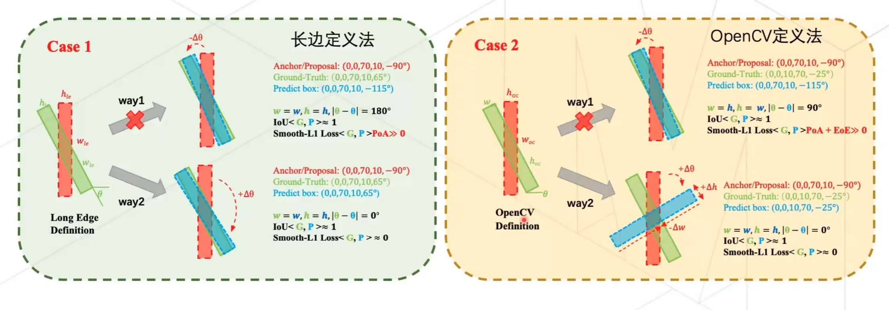

# 《社区开放麦-视觉有向目标的高精度检测》观看笔记

## 有向目标检测

### 旋转框

#### 定义

OpenCV 定义法：把“最下面”的那个点作为端点$(x,y)$（如果水平则取左边的点），找它引出的矩形边和向右的夹角$\theta_{oc}\in[-\pi/2,0)$；

>  这里的$\theta$ 指的是对于向右的水平射线，顺时针“旋转”的度数；

> 这已经是旧版本的定义方法了，新版本的规则是上下颠倒的，角度范围$\theta_{oc}\in(0,\pi/2]$。

长边定义法：找长的边和向右的水平射线的夹角。

转换时，可能不变，可能换边并且角度增减$\frac{\pi}{2}$。

#### IoU

和传统的计算方法基本一样。计算重叠面积的时候，需要把凸包分割成多个三角形，计算小三角形的面积之和。

旋转 IoU 存在一些不可导的情况。例如预测框与真实框完全重合的时候，$RIoU=1$，导致该点周围不可导，就无法进行反向传播。

## 问题与挑战

### 评估与损失不一致

两组长宽比不同但其他条件相同的矩形，Loss 理应随着长宽比增大而上升，但是 smooth-l1 对它完全没有响应。而 IoU Loss 又存在自己的问题。

### 边界不连续问题

角度是有周期性的。对于两种表达方法，在旋转 Proposal 到 Predict Box 时，经过边界位置的时候会完成一个周期，本来实际上几乎重合的框会在数值上看起来相差巨大。因此模型会选择“绕远路”走更大的角度去拟合 GT。
对于 OpenCV，问题就更大：OpenCV 的$w$和$h$是会交换的。所以它的回归方式可能会更加麻烦：先旋转一个大角度，然后再通过压缩长宽比直至相反来拟合 GT。
这样就导致了数值的不连续。

虽然这只是一个小部分的子问题，但是发生了的时候还是会造成糟糕的影响。

#### 类正方形检测问题

类正方形旋转 90 度之后，理论上它的 IoU 仍然很大，但是在长边定义法之下，它计算出来的 loss 会远远增大。

另外，长宽比越小（接近 1），IoU 对角度越不敏感，所以 Loss 不应该对类正方形的检测的角度方面太敏感。即：我们需要模型在长宽比越大的时候越注重角度的回归，反之亦然。

## 解决方法

有向目标检测分为两种设计范式。目前的检测器大多数都是采用归纳范式（从水平框的特殊情况推广到有向框的普遍情况），这种范式未必是最好的。我们采取演绎范式，提出一种新的思路：提出一种对有向框具有普适性的方法，然后再讨论特殊的水平框。

> 水平框增加旋转角度$\theta$成为有向框也有问题：五个参数的优化互相关系不大，也和形状关联不大，需要对不同的数据集手动进行超参数的设计。例如极端长宽比目标需要关注角度，小目标需要关注中心点的位置。超参数的轻微变化对精确度影响很大。

那么有了如下要求：

1. 与 IoU 度量高度一致
2. 容易实现，可微分
3. 边界情况平滑

发现高斯分布建模可以很好地满足这一点。
高斯建模恰好对角度有周期性，并且在同时交换长宽和角度偏移$\frac{\pi}{2}$之后不变。这样就解决了边界性问题。另外，对类正方形($w\approx h$)的情况，旋转 90 度之后仍然大致相等。

那我们如何衡量回归损失呢？
两个高斯分布间 Wasserstein 距离公式为：

$$
\begin{aligned}
D_{w}(\mathcal{N}_p, \mathcal{N}_q)^2 &= \|\mu_p - \mu_q\|_2^2 \\
&+ \mathrm{Tr}\!\Bigl(\Sigma_p + \Sigma_q - 2\,\bigl(\Sigma_p^{1/2}\,\Sigma_q\,\Sigma_p^{1/2}\bigr)^{1/2}\Bigr).
\end{aligned}
$$

水平情况下退化为

$$
D_{w}^2\bigl(\mathcal{N}_p, \mathcal{N}_q\bigr)
= \|\mu_p - \mu_q\|_2^2
\;+\; \bigl\|\Sigma_p^{1/2} - \Sigma_q^{1/2}\bigr\|_F^2
$$

代入发现这就是 l2-norm。
其中前半部分并没有尺度不变性，这是有很大问题的：
实验发现，两个框在以均匀的速度分离的时候，它的 loss 爆炸式增长。这明显不符合常理（因为 IoU 其实是在均匀减少的）。
这里试图将它的损失归一化，这样就能压缩它的值域，让模型可以收敛。但是仍然是治标不治本的。

考虑切换标准：KLD。

公式如下：

$$
D_{kl}(\mathcal{N}_p || \mathcal{N}_t) = \frac{1}{2} (\mu_p - \mu_t)^T \Sigma_t^{-1} (\mu_p - \mu_t) + \frac{1}{2} \text{Tr}(\Sigma_t^{-1} \Sigma_p) + \frac{1}{2} \ln \frac{|\Sigma_t|}{|\Sigma_p|} - 1
$$

或

$$
D_{kl}(\mathcal{N}_t || \mathcal{N}_p) = \frac{1}{2} (\mu_p - \mu_t)^T \Sigma_p^{-1} (\mu_p - \mu_t) + \frac{1}{2} \text{Tr}(\Sigma_p^{-1} \Sigma_t) + \frac{1}{2} \ln \frac{|\Sigma_p|}{|\Sigma_t|} - 1
$$

水平下：

$$
\begin{aligned}
D_{kl}^h(\mathcal{N}_t || \mathcal{N}_p) &= \frac{1}{2} \left( \frac{w_p^2}{w_t^2} + \frac{h_p^2}{h_t^2} + \frac{4\Delta x^2}{w_t^2} + \frac{4\Delta y^2}{h_t^2} + \ln \frac{w_t^2}{w_p^2} + \ln \frac{h_t^2}{h_p^2} -2 \right)
\\
&= 2 l_2\text{-norm}(\Delta x, \Delta y) + l_1\text{-norm}(\ln \Delta t_w, \ln \Delta t_h) + \frac{1}{2} l_2\text{-norm} \left( \frac{1}{\Delta t_w}, \frac{1}{\Delta t_h} \right) - 1
\end{aligned}
$$

对每一个参数分别求导。

- 对$\mu_p$求导，结果为
  $$
  \frac{\partial \mathbf{D}_{kl}(\mu_p)}{\partial \mu_p}
  =\left(\frac{4}{w_t^2}\Delta x, \frac{4}{h_t^2}\Delta y\right)^\top
  $$
  这里会根据 GT 的真实长宽比进行适应，调整损失。
- 对 KLD 的 $h_p$ 和 $w_p$ 求导：
  $$
    \frac{\partial D_{kl}(\Sigma_p)}{\partial \ln h_p} = \frac{h_p^2}{h_t^2}\cos^2\Delta\theta + \frac{h_p^2}{w_t^2}\sin^2\Delta\theta - 1,\\
    \frac{\partial D_{kl}(\Sigma_p)}{\partial \ln w_p} = \frac{w_p^2}{w_t^2}\cos^2\Delta\theta + \frac{w_p^2}{h_t^2}\sin^2\Delta\theta - 1
  $$
  较小的目标尺度会匹配到更大的损失，因为边越小，需要的匹配精度就越高。
- 对$\theta$求导：
  $$
  \frac{\partial D_{kl}(\Sigma_p)}{\partial \theta_p} = \left(\frac{h_p^2 - w_p^2}{w_t^2} + \frac{w_p^2 - h_p^2}{h_t^2}\right) \sin 2\Delta\theta
  $$
  假设预测良好，令$h_p = h_t, \quad w_p = w_t$，则：
  $$
  \frac{\partial D_{kl}(\Sigma_p)}{\partial \theta_p} = \left(\frac{h_t^2}{w_t^2} + \frac{w_t^2}{h_t^2} - 2\right) \sin 2\Delta\theta \geq \sin 2\Delta\theta
  $$
  发现长宽比越大，$\left(\frac{h_t^2}{w_t^2} + \frac{w_t^2}{h_t^2} - 2\right)$就越大，损失更加注重角度优化，也就是我们刚刚在类正方形检测问题中提到的要求。

KLD 甚至可以证明尺度不变性。对两个高斯分布进行不降秩的线性变换，发现 loss 一致。这表明了：无论尺度增减还是平移，损失都是稳定的。

## 扩展工作

### KFIoU

KLD 其实仅给出分布之间的距离的关系（差异），未必与 IoU 的趋势完全一致。

> 在旋转目标检测中，我们更关注的是预测框和真实框重叠区域的变化（即 IoU）。当框的位置、角度或大小发生微小变化时，IoU 会有特定的变化趋势，而 KLD 的数值变化可能不完全反映这种几何上的重叠变化。

所以提出 KFIoU 拟合 IoU Loss，发现它具有趋势一致性。

### G-Rep

完整的工作流，把传统的表示方法改成高斯分布。

三种传统的目标表示方法分别是：

1. **OBB（Oriented Bounding Box）**
   - **定义**：使用五个参数表示目标，通常包括中心坐标 (x, y)、宽度 w、高度 h 以及旋转角度 θ。
   - **优点与问题**：OBB 表示直观简单，但在回归过程中容易遇到边界不连续性问题（例如，当角度接近其定义边界时，宽高可能会发生突然的交换），以及方形问题，使得目标定位不够精确。
2. **QBB（Quadrilateral Bounding Box）**
   - **定义**：通过目标的四个角点来描述边界，即用四个点构成一个四边形。
   - **优点与问题**：相比 OBB，QBB 能够更灵活地描述目标的形状；但由于需要对四个角点进行排序匹配，会引入表示歧义的问题，即不同的角点顺序可能对应相同的物理框，从而影响损失计算和匹配精度。
3. **PointSet 表示**
   - **定义**：使用一组离散的点（例如通常设定为 9 个点）来描述目标的整体形状。
   - **优点与问题**：这种表示方法能更细致地捕捉目标的形状信息，但由于各个点是独立优化的，一旦某些点出现偏差（例如孤立点），可能会导致整体 IoU 值急剧下降，从而影响检测效果。

论文不仅提出了统一的高斯表示方法，还详细探讨了如何将传统目标表示转换为高斯分布的过程。

- **针对 PointSet 和 QBB 表示**  
  论文使用最大似然估计（MLE）算法来计算点集的均值和协方差，从而构造出对应的高斯分布。这种方法虽然通用，但在效率和精确度上可能略逊于专门针对 OBB 的方法。

- **针对 OBB 表示**  
  针对 OBB，论文采用了矩阵变换的方法，将 OBB 的参数（中心坐标、宽、高、角度）直接转换为高斯分布的参数。这种方法更加精确，并且在测试阶段可以通过高斯分布反推出 OBB，以便进行标准评估。

论文详细描述了如何利用两种方法实现传统表示到高斯分布的转换，从而统一不同目标表示形式。

之后，论文基于刚刚提到的 KLD、Wasserstein 和 Bhattacharyya 距离设计了损失函数。另外，因为传统的检测是直接根据 IoU 阈值分配正负样本，但是高斯度量的回归损失并没有这个东西，所以论文直接利用高斯距离指标进行正负样本的选取，能够更好对齐标签分配与回归优化。
