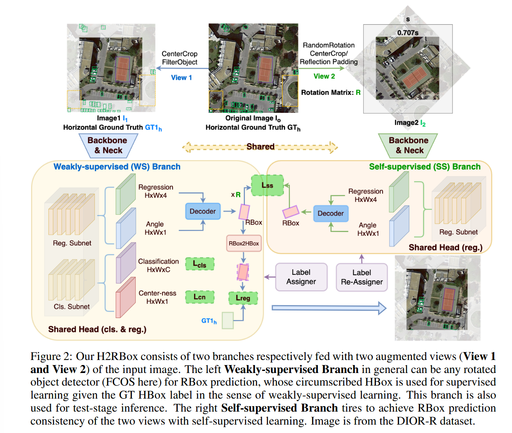
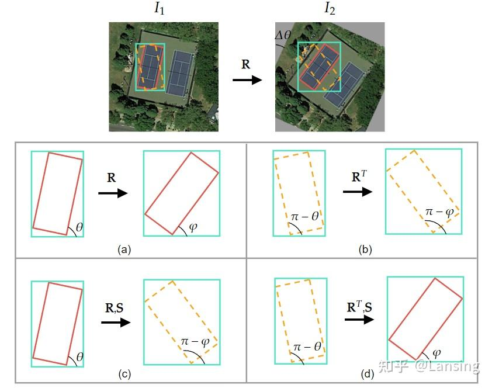
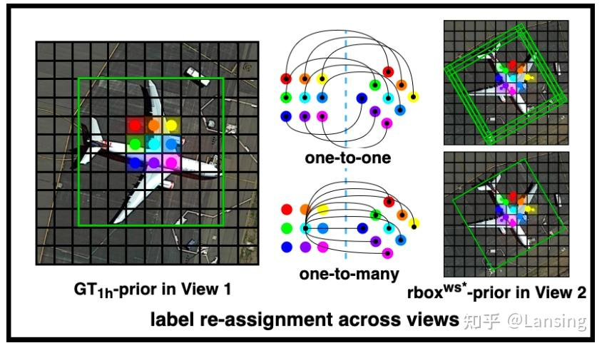

# 《H2RBOX: HORIZONTAL BOX ANNOTATION IS ALL YOU NEED FOR ORIENTED OBJECT DETECTION》阅读笔记

## 简介

通过弱监督+自监督的网络结构，实现了把水平框端到端地快速转化成旋转框。

## 背景

1. 现在带有水平框的训练集很多，但我们想要效果更优秀的旋转框。旋转框对检测效果更好，但是更加贵。
2. 能够高效把水平框转化为旋转框的方法还没有，只有一个 HBox→mask→RBox 的慢并且效果不好的方法。

## 实现

训练的时候同时使用 WS（weakly-supervised）和 SS（self-supervised），推理的时候只使用 WS，所以推理速度并不会因为多了一个分支变慢。SS 是使用旋转的增强视图训练的。最终损失为两个分支的损失的加权和。
两个分支共享 backbone，neck 和 head（回归部分）。

### WS 分支

在原来的骨干网络上直接多添加一个角度的回归。
重点在损失层面：数据集只给我们提供了水平框，那如何确定损失呢？需要一步步来：

#### 第一步：水平外接矩形限制

画出预测的旋转框的外接矩形，计算它和 GT 水平框的 Loss。

> 这个方法是有缺陷的，在 v2 中会有一种更好的方法替代。

但是在一个水平框里面会有无数个内接矩形，那就得引入 SS 分支一步步减少情况。

### SS 分支

输入：原图随机旋转后填充黑边的结果
填充黑边的目的是模型可以从黑边中学习到旋转的信息。这是不应该发生的。

#### 旋转后填充黑边的两种方法

1. 中间区域裁剪法
   把包含黑边的区域剔除（如模型示例图）。在这种操作下，需要对原图做一样的裁切。
   这种方法会降低图片的输入大小（其实不会导致损失信息，因为旋转角度是随机的，多轮训练后信息都被包含进来了），不如第二种方法表现好。
2. 反射填充法
   用轴对称的方法填充黑边。_因为黑边不参与 SS 分支的回归损失，所以填充了未标记的前景对象不会有影响_。

#### 第二步：尺度约束

要求 WS 分支和 SS 分支的预测出来的框的尺度一致，这样只剩下正确的结果和中心对称的结果。

> 为什么预测出来尺度一样就可以限制出正确的结果？因为有第一步的水平外接矩形约束，在多轮训练后，**只有一个尺度**的框在 SS 中的多种旋转后，它的水平外接矩形和 GT 的水平框高度重合。

对于下面两条公式：

$$
w_{\text{gt}} = w |\cos\theta| + h |\sin\theta|\\
h_{\text{gt}} = w |\sin\theta| + h |\cos\theta|
$$

其中$w$和$h$为弱监督旋转框的长宽，模型会不断在 SS 分支的不同的旋转角下修正它们，让$w$和$h$始终在所有的$\theta$下都符合条件。

> 首先 ss 阶段是没有 gt 的，是一个 inference 过程。由于 ss 和 ws 是共享参数的，所以它随着 ws 的训练，也可以较好检测出任意图像上目标的水平外接矩形，也就知道了 $w_{ss}$ 和 $h_{ss}$。
> 其实就是文中提到的外接矩形约束，输入任意的图像，网络都可以输出一个 rbox，这个 rbox 的水平外接矩形就是目标的水平 gt，也就知道了对应的 $w_{ss} $和 $h_{ss}$。

#### 第三步：角度约束

显然如上的约束过后，会弄出来两对框。这里称正确预测框为真框，它的对称框为假框。
那么有：
|真框|假框|
|-|-|
| WS 的真框 A | WS 的假框 C |
| SS 的真框 B | SS 的假框 D |

对于模型来说，图片进入 SS 以前，旋转的方式是已知的。我们可以通过旋转的方式匹配出两个真框，因为只有两个真框的线性变换关系是$R$。

---

SS 前的旋转公式为：

$$
(x^*, y^*) = (x - x_c, y - y_c) \mathbf{R}^\top + (x_c, y_c), \quad \\\mathbf{R} = \begin{pmatrix} \cos \Delta \theta & -\sin \Delta \theta \\ \sin \Delta \theta & \cos \Delta \theta \end{pmatrix}
$$

**对旋转矩阵和该公式的小推导**

设 $\vec{b}$ 为起始点为$(x_c,y_c)$，终点为$(x,y)$的向量，旋转后的点为$(x^*,y^*)$

极坐标下， $\vec{b} = |b| (\cos \varphi, \sin \varphi)$

令$R$为旋转矩阵，将向量$\vec{b}$**逆时针旋转**，有

$$
\begin{aligned}
\vec{b}R &= |b| (\cos(\varphi + \theta), \sin(\varphi + \theta)) \\&= |b| (\cos \varphi \cos \theta - \sin \varphi \sin \theta,  \sin \varphi \cos \theta + \cos \varphi \sin \theta)
\end{aligned}
$$

令 $(\cos \varphi \cos \theta - \sin \varphi \sin \theta, \sin \varphi \cos \theta + \cos \varphi \sin \theta) = (\cos \varphi, \sin \varphi) R^T$

由待定系数法，得

$$ R^T = \begin{pmatrix} \cos \theta & \sin \theta \\ -\sin \theta & \cos \theta \end{pmatrix} $$

顺时针旋转时，代入$\theta=-\theta$，发现化出来的是$R$。

对图片旋转，相当于对坐标系在同一方向旋转，相当于把点向逆方向旋转。所以上面乘的是$R^T$。对坐标的表示形式简单进行向量加减法即可。

---

### 标签重分配

WS 分支和 SS 分支会输出一堆 RBox，需要找到一一对应的方式才能计算一致性损失。

1. O2O：一对一匹配
2. O2M：令最接近 GT 框的 WS 分支中的框作为 SS 分支的目标框
   

### 损失函数

总的损失函数为$L_{total} = L_{ws} + λL_{ss}$，论文使用的$\lambda=0.4$

分为两个分支看。

#### WS 分支

$$
\begin{aligned}
&L_{ws} = \frac{\mu_1}{N_{\text{pos}}} \sum_{(x, y)} L_{cls}\left(p_{(x, y)}, c_{(x, y)}\right) + \frac{\mu_2}{N_{\text{pos}}} \sum_{(x, y)} L_{cn}\left(cn_{(x, y)}^{\prime}, cn_{(x, y)}\right) \\
&+ \frac{\mu_3}{\sum cn_{\text{pos}}} \sum_{(x, y)} \mathbb{1}_{\left\{c_{(x, y)} > 0\right\}} cn_{(x, y)} L_{reg}\left(r2h\left(rbox_{(x, y)}^{ws}\right), gtbox_{(x, y)}^h\right)
\end{aligned}
$$

拆解来看：

$$
L_{ws} = \underbrace{\frac{\mu_1}{N_{pos}} \sum L_{cls}}_{\text{分类损失}} + \underbrace{\frac{\mu_2}{N_{pos}} \sum L_{cn}}_{\text{中心度损失}} + \underbrace{\frac{\mu_3}{\sum cn_{pos}} \sum \left( cn \cdot L_{reg} \right)}_{\text{回归损失}}
$$

这个损失其实就是基于 FCOS 的损失。

- 分类损失：focal 损失，用正样本数量归一化，就是常规类别误差。
- 中心度损失：交叉熵损失，看看预测出来的框的中心和 GT 的中心偏移多少。CN 是中心点。
- 回归损失：IoU 损失，先找到旋转框的外接矩形框，再计算它和 GT 的 IoU 误差。c=0 是负样本，不参与这个的计算。

这里设置三个权重都为 1.

#### SS 分支

SS 分支不用找分类损失，只有一个目的：消除角度预测的多解性。

$$
L_{ss} = \frac{1}{\sum cn^*_{pos}} \sum \left( cn^* \cdot \underbrace{L_{reg}(rbox_{ws}^*, rbox_{ss})}_{\text{旋转一致性回归损失}} \right)
$$

这里同样有约束负样本不参与计算，没写出来。

> 论文里把$w$、$h$ 和 $θ$ 两部分损失解耦开算了，$w$、$h$ 部分的损失是计算投影到中心点为（0，0）或者是同中心的水平框之间的 IoU 损失，角度部分就是简单的角度差取三角函数防止角度周期性问题。最后之所以用 min，是考虑多种投影方式，因为有时候边在特殊情况下会出现交换。
> 其实你可以简单把 $L_{whθ}$ 理解成计算的是两个分支预测的 rbox 的重叠程度就行，如旋转 IoU 损失。

SS 分支预测的 RBox $rbox_{ss} = (x_{ss}, y_{ss}, w_{ss}, h_{ss}, \theta_{ss})$需与理论值（WS 分支提供的“目标框”）$rbox_{ws}^*$对齐，损失函数由两部分组成：

$$
   L_{reg} = \gamma_1 L_{xy} + \gamma_2 L_{wh\theta}
$$

前面的是中心度损失：

$$
L_{xy} = |x_{ss} - x^*| + |y_{ss} - y^*|
$$

后面的是宽高和角度损失，这个公式很复杂，因为要防止角度周期性：
$$
L_{wh\theta} = \min \left\{ \text{IoU}(B_{ws}, B_{ss}^1) + |\sin(\theta^* - \theta_{ss})|, \, \text{IoU}(B_{ws}, B_{ss}^2) + |\cos(\theta^* - \theta_{ss})| \right\}
$$
本质上就是进行了一个角度损失和IoU损失的叠加。

>角度周期性问题前面已经提到过了（跳变）。宽高交换问题指的是$w$和$h$互换并且旋转90度之后，本质上这个图形是一样的。需要模型认为这两种图形等价，才能避免预测歧义。