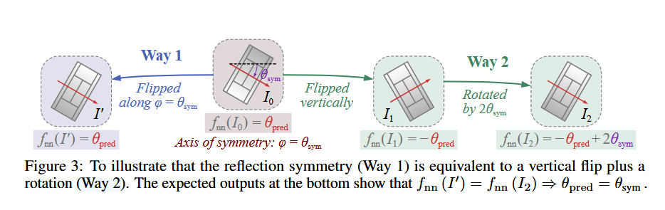
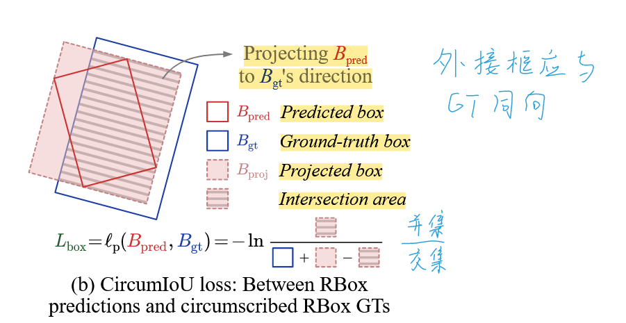
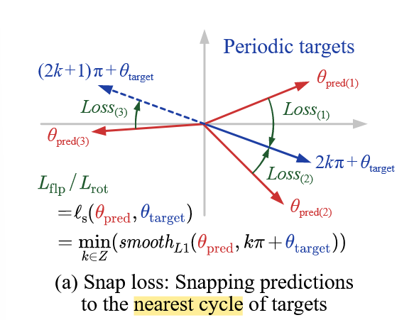

# 《H2RBox-v2: Incorporating Symmetry for Boosting Horizontal Box Supervised Oriented Object Detection》阅读笔记

## 简介

对比起上一个版本，H2RBox-v2 运用了对称性实现 SS 分支，优化了检测器的方向预测性能。同时略微修改了 WS 分支，使它能够运用旋转数据增强和更好应对角度周期性。

## 背景

H2RBox 已经能做到比较好的水平框到旋转框的效果。但是遗憾的是，它还是比较依赖训练数据的样本量和精确度。

## 实现

### SS 分支

#### SS 分支的原理

首先，我们设计一个神经网络$f_{nn}$，它输入一个图像$I$后，会输出一个实数（角度）$\theta$。我们目前并不知道这个网络是有什么用的。

然后我们要求这个网络具备两个性质：

1. 翻转一致性
   $$f_{nn}(I) + f_{nn}(\text{flp}(I)) = 0$$
   翻转之后，网络会输出相反数。
2. 旋转一致性
   $$f_{nn}(\text{rot}(I, \mathcal{R})) - f_{nn}(I) = \mathcal{R}$$
   $ \text{rot}(I, \mathcal{R}) $ 表示把$ I $ 旋转 $ \mathcal{R} $。

网络得到这两个性质之后：
假设我们有一个图片$I_0$，设它的对称轴和水平方向的锐角夹角为$\theta_{sym}$，把它塞进这个网络后，得到结果$\theta_{pred}$。
我们把它沿着对称轴翻转，得到$I^\prime$，但其实它并没有任何变化。所以$f_{nn}(I_0)=f_{nn}(I^\prime)=\theta_{pred}$。
我们把它沿着纵向翻转，然后顺时针旋转$2\theta_{sym}$，得到$I_2$。这个时候它的输出是$f_{nn}(I_2) = -{\theta}_{\text{pred}} + 2\theta_{\text{sym}}$。

这两个图像是一样的。所以我们有：

$$
\theta_{pred} = -{\theta}_{\text{pred}} + 2\theta_{\text{sym}} \\\Rightarrow \theta_{\text{sym}} = \theta_{pred}
$$

因此，我们只要**训练出具有上面两条性质的网络**，就可以让这个网络输出对称轴的角度，也就是目标的方向。这个利用两条损失函数控制网络就可以做到。

这里其实是忽略了角度周期性的。后续在设计损失函数的时候会处理。

#### 结构

把原始图像翻转和旋转之后，分别输入共享的 backbone 和 neck，预测角度。
这里的角度使用了 PSC 编码消除角度周期性。然后再计算角度之间的翻转一致性损失和旋转一致性损失，加权相加即可。

> PSC 编码使用了三个余弦值来编码角度。因为余弦函数是连续函数，所以通过特殊的方式编码后，不会有边界不连续问题和正方形目标问题（预测的值是余弦函数值）。同时相比起离散编码来说检测精度更高。

### WS 分支

总体和前身一样，但是多了两个改进：

1. 删除了角度预测。因为 SS 分支已经提供角度预测了。
2. 前身是先计算水平外接矩形再计算它和水平框 GT 的 IoU Loss，这样它本身就不可以进行旋转增强（因为旋转会让 GT 变成非水平框）。因此作者提出了新的损失函数解决这个问题。
   

### 损失函数

总损失为两个分支的加权和：
$$L_{\text{total}} = L_{\text{ws}} + \mu_{\text{ss}} L_{\text{ss}}$$

#### SS 分支

为了解决角度周期性问题，我们使用 snap loss 来计算 flp 和 rot 视图的损失。snap loss 定义如下：

$$
\ell_{s}\left(\theta_{\text{pred}}, \theta_{\text{target}}\right) = \min_{k \in \mathbb{Z}} \left( \text{smooth}_{L1}\left(\theta_{\text{pred}}, k\pi + \theta_{\text{target}}\right) \right)
$$

从视觉层面来解释，预测框在一个方向远离目标框的时候，实际上是在另外一个方向接近目标框。所以找到和预测出来的框最“接近”的那一侧，来计算损失。

$$
L_{\text{flip}} = \ell_s\left(\theta_{\text{flip}} + \theta, 0\right)
$$

$$
L_{\text{rot}} = \ell_s\left(\theta_{\text{rot}} - \theta, \mathcal{R}\right)
$$

总损失为两者的加权和。
$$L_{\text{ss}} = \lambda L_{\text{flip}} + L_{\text{rot}}$$

#### WS 分支

和上面提到的一样，我们令
$$L_{box}=\ell_p\left(B_{\text{pred}}, B_{\text{gt}}\right) = -\ln\frac{B_{\text{proj}} \cap B_{\text{gt}}}{B_{\text{proj}} \cup B_{\text{gt}}}$$
于是该分支的损失为：
$$L_{\text{ws}} = L_{\text{cls}} + \mu_{\text{cn}} L_{\text{cn}} + \mu_{\text{box}} L_{\text{box}}$$
